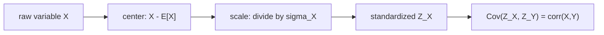

# Quant 4 · 协方差、相关系数与相关矩阵 PSD

这类题经常问：

```text
给 n 个随机变量 X1,...,Xn。
所有两两相关系数之和最小可能是多少？
```

最短答案是：

$$
\sum_{1\le i<j\le n}\operatorname{corr}(X_i,X_j)\ge -\frac n2
$$

当 $n=4$ 时，下界是：

$$
-\frac42=-2
$$

这个结论不是靠猜相关系数。它来自一个基本事实：

```text
任何随机变量的方差都不能为负。
```

相关矩阵半正定，就是这句话的矩阵版本。

---

## 1. 协方差在量什么

设 $X,Y$ 是两个随机变量。协方差定义为：

$$
\operatorname{Cov}(X,Y)
=
\mathbb{E}\left[(X-\mathbb{E}X)(Y-\mathbb{E}Y)\right]
$$

它看的是两个变量偏离均值时，是不是经常同向变化。

| 情况 | 直觉 | 协方差符号 |
| --- | --- | --- |
| $X$ 大于均值时，$Y$ 也常大于均值 | 同涨同跌 | 正 |
| $X$ 大于均值时，$Y$ 常小于均值 | 一个涨一个跌 | 负 |
| 没有稳定线性关系 | 线性同动弱 | 接近 0 |

轻量图像可以这样记：

```text
positive covariance        negative covariance        near zero covariance

y                          y                          y
|        *                 | *                        |   *    *
|      *                   |   *                      | *   *
|    *                     |     *                    |      *
|  *                       |       *                  | *       *
+--------- x               +--------- x               +--------- x
```

协方差有一个缺点：它受单位影响。把美元换成美分，协方差会放大很多。所以面试题通常用相关系数。

---

## 2. 相关系数是标准化后的协方差

相关系数定义为：

$$
\operatorname{corr}(X,Y)
=
\frac{\operatorname{Cov}(X,Y)}{\sigma_X\sigma_Y}
$$

其中：

$$
\sigma_X=\sqrt{\operatorname{Var}(X)},\qquad
\sigma_Y=\sqrt{\operatorname{Var}(Y)}
$$

也可以先把变量标准化：

$$
Z_X=\frac{X-\mathbb{E}X}{\sigma_X},
\qquad
Z_Y=\frac{Y-\mathbb{E}Y}{\sigma_Y}
$$

标准化以后：

$$
\mathbb{E}Z_X=0,\qquad \operatorname{Var}(Z_X)=1
$$

于是：

$$
\operatorname{corr}(X,Y)=\operatorname{Cov}(Z_X,Z_Y)
$$

可以把相关系数看成“去掉单位以后，两个变量的线性同动强度”。



---

## 3. 为什么相关系数一定在 [-1,1]

标准化后，$\operatorname{Var}(Z_X)=\operatorname{Var}(Z_Y)=1$。对任意实数 $t$：

$$
\operatorname{Var}(Z_X-tZ_Y)\ge0
$$

展开：

$$
\operatorname{Var}(Z_X-tZ_Y)
=
1-2t\operatorname{Cov}(Z_X,Z_Y)+t^2
$$

记：

$$
\rho=\operatorname{corr}(X,Y)=\operatorname{Cov}(Z_X,Z_Y)
$$

则：

$$
t^2-2\rho t+1\ge0,\qquad \forall t
$$

这个二次函数对所有 $t$ 都非负，所以判别式不能为正：

$$
(-2\rho)^2-4\le0
$$

因此：

$$
\rho^2\le1
$$

也就是：

$$
-1\le \operatorname{corr}(X,Y)\le 1
$$

注意：$\rho=0$ 只表示没有线性相关，不等于独立。独立会推出协方差为 0，但反过来不一定成立。

---

## 4. 协方差矩阵和相关矩阵

给随机变量 $X_1,\ldots,X_n$，协方差矩阵是：

$$
\Sigma_{ij}=\operatorname{Cov}(X_i,X_j)
$$

对角线是方差：

$$
\Sigma_{ii}=\operatorname{Var}(X_i)
$$

如果每个变量先标准化：

$$
Z_i=\frac{X_i-\mathbb{E}X_i}{\sigma_i}
$$

那么相关矩阵就是这些 $Z_i$ 的协方差矩阵：

$$
R_{ij}
=
\operatorname{corr}(X_i,X_j)
=
\operatorname{Cov}(Z_i,Z_j)
$$

所以：

$$
R=
\begin{pmatrix}
1 & \rho_{12} & \cdots & \rho_{1n}\\
\rho_{21} & 1 & \cdots & \rho_{2n}\\
\vdots & \vdots & \ddots & \vdots\\
\rho_{n1} & \rho_{n2} & \cdots & 1
\end{pmatrix}
$$

相关矩阵有三个基本性质：

| 性质 | 原因 |
| --- | --- |
| 对称 | $\operatorname{corr}(X_i,X_j)=\operatorname{corr}(X_j,X_i)$ |
| 对角线为 1 | 每个标准化变量和自己的相关系数是 1 |
| 半正定 | 任意线性组合的方差非负 |

第三条最重要。

---

## 5. 为什么相关矩阵一定 PSD

取任意实数 $a_1,\ldots,a_n$，考虑：

$$
W=a_1Z_1+\cdots+a_nZ_n
$$

这是一个随机变量，所以：

$$
\operatorname{Var}(W)\ge0
$$

展开方差：

$$
\operatorname{Var}(W)
=
\operatorname{Var}\left(\sum_{i=1}^n a_iZ_i\right)
=
\sum_{i=1}^n\sum_{j=1}^n a_i a_j \operatorname{Cov}(Z_i,Z_j)
$$

而 $\operatorname{Cov}(Z_i,Z_j)=R_{ij}$，所以：

$$
\operatorname{Var}(W)=a^\top R a
$$

于是对任意向量 $a$：

$$
a^\top R a\ge0
$$

这就是半正定的定义：

$$
R\succeq0
$$

记忆图：

```text
choose weights a1,...,an
        |
        v
linear combination W = sum ai Zi
        |
        v
variance Var(W) cannot be negative
        |
        v
a^T R a >= 0 for every a
        |
        v
R is PSD
```

---

## 6. 几何理解：相关矩阵是 Gram matrix

可以把标准化随机变量看成向量，内积定义为：

$$
\langle Z_i,Z_j\rangle=\operatorname{Cov}(Z_i,Z_j)
$$

因为：

$$
\langle Z_i,Z_i\rangle=\operatorname{Var}(Z_i)=1
$$

每个 $Z_i$ 都像一个单位向量。相关系数就是两个单位向量的夹角余弦：

$$
\operatorname{corr}(X_i,X_j)=\cos\theta_{ij}
$$

相关矩阵就是这些向量两两内积组成的 Gram matrix：

$$
R_{ij}=\langle Z_i,Z_j\rangle
$$

Gram matrix 一定 PSD，因为：

$$
a^\top R a
=
\left\langle \sum_i a_iZ_i,\sum_j a_jZ_j\right\rangle
=
\left\|\sum_i a_iZ_i\right\|^2
\ge0
$$

概率语言里，这是方差非负；几何语言里，这是长度平方非负。

```text
probability view:
  Var(sum ai Zi) >= 0

geometry view:
  ||sum ai vi||^2 >= 0

same statement
```

---

## 7. 例题：四个变量两两相关系数之和的最小值

题目可以写成：

```text
给四个随机变量 X1, X2, X3, X4。
假设每个变量方差非零。
求所有两两相关系数之和的最小可能值：

corr(X1,X2)+corr(X1,X3)+corr(X1,X4)
+ corr(X2,X3)+corr(X2,X4)+corr(X3,X4)
```

记：

$$
\rho_{ij}=\operatorname{corr}(X_i,X_j)
$$

把变量标准化：

$$
Z_i=\frac{X_i-\mathbb{E}X_i}{\sigma_i}
$$

那么：

$$
\operatorname{Var}(Z_i)=1,\qquad
\operatorname{Cov}(Z_i,Z_j)=\rho_{ij}
$$

现在考虑所有标准化变量之和：

$$
W=Z_1+Z_2+Z_3+Z_4
$$

方差非负：

$$
\operatorname{Var}(W)\ge0
$$

展开：

$$
\operatorname{Var}(Z_1+Z_2+Z_3+Z_4)
=
\sum_{i=1}^4\operatorname{Var}(Z_i)
+2\sum_{1\le i<j\le4}\operatorname{Cov}(Z_i,Z_j)
$$

因为每个 $\operatorname{Var}(Z_i)=1$，所以：

$$
\operatorname{Var}(W)
=
4+2\sum_{1\le i<j\le4}\rho_{ij}
$$

由 $\operatorname{Var}(W)\ge0$ 得：

$$
4+2\sum_{1\le i<j\le4}\rho_{ij}\ge0
$$

所以：

$$
\sum_{1\le i<j\le4}\rho_{ij}\ge -2
$$

这说明答案不可能小于 $-2$。

### 7.1 为什么这个下界真的能达到

还要证明 $-2$ 不是只由不等式给出的假下界。我们构造一个合法相关矩阵：

$$
R=
\begin{pmatrix}
1 & -1/3 & -1/3 & -1/3\\
-1/3 & 1 & -1/3 & -1/3\\
-1/3 & -1/3 & 1 & -1/3\\
-1/3 & -1/3 & -1/3 & 1
\end{pmatrix}
$$

它的六个非对角相关系数都等于 $-1/3$，所以两两相关系数之和是：

$$
6\cdot\left(-\frac13\right)=-2
$$

这个矩阵是 PSD。直观上，它对应三维空间里正四面体的四个顶点方向：四个单位向量对称地指向不同方向，中心在原点，任意两条方向的点积都是 $-1/3$。

```text
four standardized variables
        |
        v
regular tetrahedron directions
        |
        v
all pairwise correlations = -1/3
        |
        v
sum of 6 correlations = -2
```

更代数一点，取：

$$
R=\frac{4}{3}I-\frac{1}{3}J
$$

其中 $J$ 是全 1 矩阵。向量 $\mathbf{1}=(1,1,1,1)$ 对应特征值：

$$
\frac43-\frac13\cdot4=0
$$

任何与 $\mathbf{1}$ 正交的方向，对应特征值：

$$
\frac43
$$

所以 $R$ 的特征值是：

$$
0,\frac43,\frac43,\frac43
$$

全部非负，因此它是合法相关矩阵。可以取一个均值为 0、协方差为 $R$ 的四维正态随机向量，这就构造出了达到下界的随机变量。

最终答案：

$$
\boxed{-2}
$$

---

## 8. 一般化：$n$ 个变量的答案是 $-n/2$

同样的推导对 $n$ 个变量成立。

标准化：

$$
Z_i=\frac{X_i-\mathbb{E}X_i}{\sigma_i}
$$

考虑：

$$
W=Z_1+\cdots+Z_n
$$

因为：

$$
\operatorname{Var}(W)\ge0
$$

展开：

$$
\operatorname{Var}(W)
=
n+2\sum_{1\le i<j\le n}\operatorname{corr}(X_i,X_j)
$$

所以：

$$
\sum_{1\le i<j\le n}\operatorname{corr}(X_i,X_j)
\ge
-\frac n2
$$

这个下界也能达到。令所有非对角相关系数都相等：

$$
\rho_{ij}=-\frac{1}{n-1},\qquad i\ne j
$$

那么两两之和是：

$$
\binom n2\left(-\frac{1}{n-1}\right)
=
\frac{n(n-1)}{2}\left(-\frac{1}{n-1}\right)
=
-\frac n2
$$

对应相关矩阵是：

$$
R=
\frac{n}{n-1}I-\frac{1}{n-1}J
$$

它的特征值是：

$$
0,\frac{n}{n-1},\ldots,\frac{n}{n-1}
$$

所以它是 PSD，也就是合法相关矩阵。

几何上，这是 $n-1$ 维空间里正 simplex 的 $n$ 个顶点方向。每个方向都是单位向量，所有向量加起来为 0，任意两两点积都是：

$$
-\frac{1}{n-1}
$$
